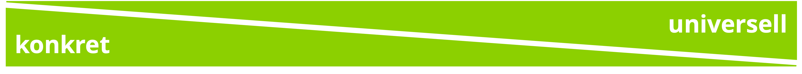
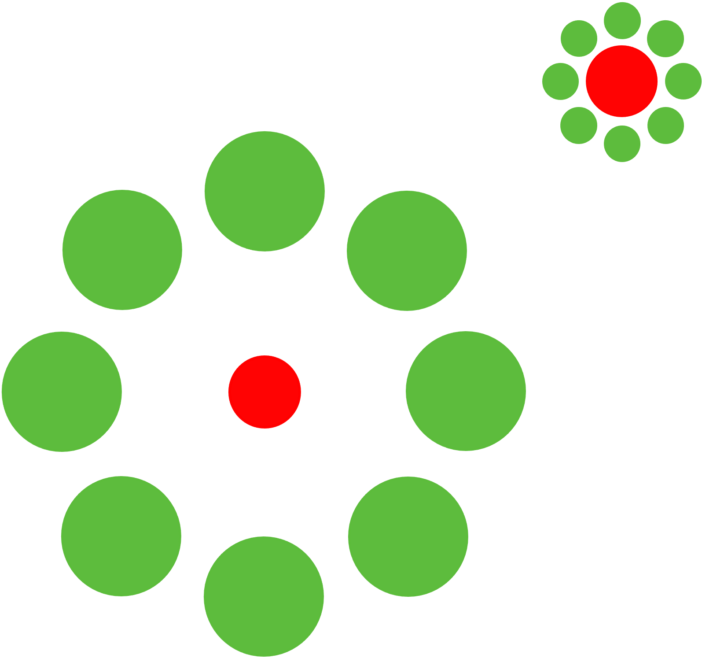
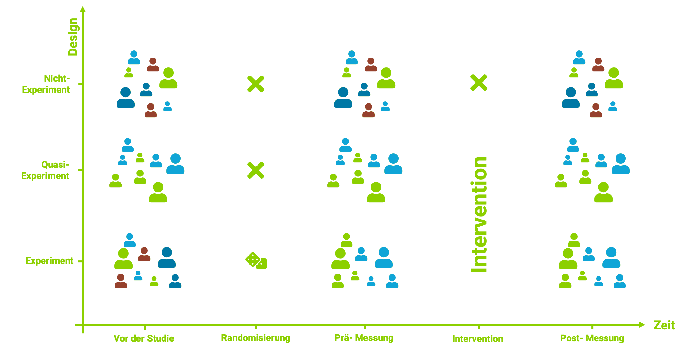

layout: true
background-image: url(https://live.staticflickr.com/65535/50973602108_8fce3f8f28_k.jpg)
background-size: cover

<head>
<script src="https://kit.fontawesome.com/994a28441d.js" crossorigin="anonymous"></script>
</head>

<!--<div class="my-footer"><span>Folien CC-BY verfügbar unter https://atelier-phka-merk-2020.netlify.app</span></div> --> 

---

name: title
class: center, middle, hide_logo
<!--
<style>
.remark-slide-number {
  font-size: 10pt;
  margin-bottom: -11.6px;
  margin-right: 10px;
  color: red; /* white */
  opacity: 0; /* default: 0.5 */
}
</style>
-->

```{r xaringan-themer, echo=F, warning=FALSE}
library(xaringanthemer)
library(fontawesome)
library(xaringanExtra)
htmltools::tagList(rmarkdown::html_dependency_font_awesome()) 

extra_css <- list(
   ".timevis.html-widget .vis-background .vis-minor.vis-odd" = 
        list("background" = "#8CD00030"),
   ".vis-text" = list("color" = "#ffffff !important"),
   ".vis-timeline" = list("border" = "transparent"),
   ".vis-item" = list("border-color" = "#8CD000", 
                      "background-color" = "#8CD000", 
                      "color" = "#ffffff !important"),
   ".vis-current-time" = list("background-color" = "#8CD00000"),
  ".cit"  = list("font-size" = "70%",
                 "color" = "#6AEE3E90"),
  ".em05" = list("font-size" ="0.5em"),
  ".em06" = list("font-size" ="0.6em"),
  ".em07" = list("font-size" ="0.7em"),
  ".em08" = list("font-size" ="0.8em"),
  ".em09" = list("font-size" ="0.9em"),
  ".em11" = list("font-size" ="1.1em"),
  ".em12" = list("font-size" ="1.2em"),
  ".em13" = list("font-size" ="1.3em"),
  ".em14" = list("font-size" ="1.4em"),
  ".em15" = list("font-size" ="1.5em"),
  ".bold" = list("font-weight" = "bold"),
  ".large" = list("font-size" = "160%"),
  ".vertmiddle" = list("vertical-align" ="middle"),
  #".lh15" = list("line-height" =  "1.5"),
  ".li" = list("line-height" =  "1.5",
               "font-size" = "160%",
               "font-weight" = "bold"),
  ".phgreen" = list("color" = "#50B32E"),
  ".phgreenlight" = list("color" = "#62DC3A"),
  ".my-footer" = list("background-color" = "#1a1917",
                      "position" = "absolute",
                      "bottom" = "0px",
                      "left" = "0px",
                      "height" = "20px",
                      "width" = "100%"),
  ".my-footer span" = list("font-size" = "10pt", 
                           "color" = "#F7F8FA",
                           "position" = "absolute",
                           "left" = "15px",
                           "bottom" = "2px"),
  #".remark-slide-number" = list("bottom" = "18px"),
  ".li" = list("line-height" =  "4"),
  ".scroll-box-18" = list("height" ="18em",
                           "overflow-y" = "scroll"),
  ".scroll-box-23" = list("height" ="23em",
                           "overflow-y" = "scroll"),
  ".hscroll-box-30" = list("width" ="23em",
                           "overflow-x" = "scroll"))

style_mono_accent(
  text_color = "#ffffff",
  base_color           = "#ffffff",
  header_font_google   = google_font("Roboto", "700"),
  text_font_google     = google_font("Roboto", "500"),
  code_font_google     = google_font("Droid Mono"),
  extra_css = extra_css,
  inverse_background_color = "#ffffff",
  inverse_text_color = "#000000",
  link_color = "#6AEE3E"
)

use_logo(
  image_url = "https://live.staticflickr.com/65535/50974533397_9ac99f9a48_o.png",
  width = "180px",
  position = css_position(top = "1.5em", right = "1.5em")
)

use_editable(expires = 1)
```


# .white[Vorlesung]

.em14[<i class="fas fa-microscope fa-5x"></i>]

### .white[Einführung in qualitative und quantitative Forschungsmethoden - M12A PdK]

  &nbsp;&nbsp;&nbsp;&nbsp;


.em14[.white[&nbsp;&nbsp;&nbsp;&nbsp;&nbsp;&nbsp;André Epp | Samuel Merk]]  


---
class: center middle hide_logo

 <i class="fas fa-door-open fa-5x"></i> 
# Herzlich willkommen!  

---
## <i class="fas fa-user-graduate"></i> Mit wem haben Sie es zu tun?
&nbsp;  
&nbsp;   
&nbsp;  
```{r, echo = F, warning=FALSE}
library(timevis)
data <- data.frame(
  id      = 1:4,
  content = c("Item one", "Item two",
              "Ranged item", "Item four"),
  start   = c("2016-01-10", "2016-01-11",
              "2016-01-20", "2016-02-14 15:00:00"),
  end     = c(NA, NA, "2016-02-04", NA)
)

data <- data.frame(
  #id      = 1:4,
  content = c("Erstes SE"  ,"Zweites SE"  ,"Promotion", "Jun. Prof. TÜ", "Jun. Prof. KA"),
  start   = c("2010-01-10", "2011-06-11", "2016-07-10", "2017-04-01", "2020-04-01"),
  end     = rep(NA, 5)
)

timevis(data, 
        loadDependencies = F, 
        width = "1082", 
        showZoom = F)
```

---
class: middle, center
# Heutige Vorlesung

.large[<i class="fas fa-charging-station"></i> Motivierung: Wozu _Forschung_ in der Erzieher:innenbildung?]  
&nbsp;  

--
.large[<i class="fas fa-microscope"></i> Inhaltliche Einführung: Was ist Wissenschaft?]  
&nbsp;  

--
.large[<i class="fas fa-microscope"></i> Inhaltliche Einführung: Studienarten, Studiendesigns]  
&nbsp;  

--
.large[<i class="fas fa-sitemap"></i> Organisatorische Einführung]  
&nbsp;  

--
.large[<i class="far fa-question-circle"></i> Ihre Fragen]  


---
class: middle center hide_logo
## <i class="fas fa-charging-station"></i> Motivierung: <br> Wozu _Forschung_ in der Erzieher:innenbildung?

---
## Charakteristika des Erziehens .cit[(Doyle, 1986)]

```{r, echo = F, message=FALSE, fig.align='center', warning=FALSE, fig.width=14}
library(tidyverse)
library(highcharter)
library(viridisLite)
hchart(
  tibble(
  word = sample(c("Multidimensionalität", "Simultanität", 
                              "Unmittelbarkeit", "Unvorhersehbarkeit", 
                              "Öffentlichkeit", "Historizität"), 30, replace = T),
  freq = sample(1:50, 30, replace = T)),
  "wordcloud",
  hcaes(name = word, weight = log(freq)),
  ) %>% 
   hc_colors("#8CD000")

```

???
Unvorhersehbarkeit --> Probealarm, Schülerin lässt etwas fallen, Kollegin hat Videogerät nciht zurückgebracht  

Öffentlichekeit -->  

Multidimensionalität --> Reagenzglasständer  

Simultanität --> Entwicklen Chlorgas; Kollege im nebenraum schreit die Schüler an; RAUCHEN; MISSBRAUCH  

Historizität --> Vetretungsstunde  

Unmittelbarkeit --> Reagenzglasständer  


---
class: middle, center, hide_logo

### Eine kompetenztheoretische Begründung:

--
.large["_Kompetenzen sind latente, domänenspezifische Dispositionen, die die erfolgreiche Problemlösung wahrscheinlicher machen_"]

--
.pull-left[
#### Bsp. Mathematik
"_Hr. Müller fährt auf der Autobahn, sieht auf einer App, dass die nächsten Tankstellen in 3km, 65km und 120km kommen mit den Preisen 1,49€, 1,45€ und 1,38€. Ein Blick auf das Amaturenbrett verrät ihm, dass sein Tank noch zu einem Achtel gefüllt ist, weshalb er sich fragt, bis zu welcher Tankstelle er fahren sollte._"]


--
.pull-right[
#### Bsp. GPK 
"_Hr. Müller plant Projektarbeit mit 5-Jährigen zum Thema Regenwürmer. Er fragt sich ob er mit einer Problemstellung oder mit Vorwissensaktivierung anfangen soll, wie groß die Gruppe sein kann und wie er möglichst sprachsensibel vorgehen kann._"]

--
```{r, echo = F, fig.align='center', out.width="70%", fig.cap="Trade Off von Anwendungsspektrum und Passung"}

```

???
Trick: Projekt-Gruppe ist etwas konfus --> Alle aufstehen, Bewegungsspiel
Kompetenz-Gruppenmobilisierung: --> 

---
class: middle, center, hide_logo

### Eine bildungstheoretische Begründung


---
## Eine kognitionspsychologische Begründung

--
.center[.em15[Menschliche Wahrnehmung ist verzerrt]]

--
.center[
.pull-left[
```{r, echo=FALSE, fig.cap="Ebbinghaustäuschung (Massaro & Anderson, 1971)", out.width="60%"}

```
]]

--
.pull-right[
<iframe width="560" height="315" src="https://www.youtube.com/embed/IGQmdoK_ZfY?start=08" title="YouTube video player" frameborder="0" allow="accelerometer; autoplay; clipboard-write; encrypted-media; gyroscope; picture-in-picture" allowfullscreen></iframe>

.center[Monkeybusinessillusion (Kleinman & Anandarajan, 2011)]]

???
Dadurch halten sich Mythen wie Enuresis

---
## Eine kognitionspsychologische Begründung
### Menschliche Wahrnehmung ist verzerrt
* Confirmation Bias .cit[(Nickerson, 1998)]
* Anchor Bias .cit[(Tversky & Kahneman, 1974)]
* Hindsight Bias .cit[(Langfeldt, 1989)]
* Positive Testing .cit[(Snyder & Swann, 1978)]


---
class: middle center hide_logo
## <i class="far fa-smile-wink"></i> Hedonistische Begründung 


### It's fun:
.large[
.pull-left[
```{r, echo = F, message=FALSE}
library(flextable)
flextable(
  tibble(
    Fakultät = c("Studenten", "Studentinnen"),
    `Fakultät A` = c("100%", "90%"),
    `Fakultät B` = c("60%", "50%"))) %>% 
  width(width = .95) %>% 
  color(color = "white", part = "all")
```
]]


.large[
.pull-right[
```{r, echo = F}
library(flextable)
flextable(
  tibble(
    Gruppe = c("Studenten", "Studentinnen"),
    `Fakultät A` = c("200/200", "900/1000"),
    `Fakultät B` = c("600/1000", "100/200"),
    `Gesamt %` = c("~67%", "~83%")))  %>% 
  width(width = .95) %>% 
  color(color = "white", part = "all")
```
]
]

Tabellen stellen sog. Simpsons Paradox .cit[(Simpson, 1951)] dar.

---
class: middle center hide_logo
## <i class="fas fa-charging-station"></i> Motivierung (Zusammenfassung): <br> Wozu _Forschung_ in der Erzieher:innenbildung?

--
.large[Kompetenztheoretischer Grund: ⇒ Wissen über Forschung macht Sie (mittelbar) kompetenter ]  
&nbsp;  

--
.large[Bildungstheoretischer Grund: ⇒ Wissen über Forschung emanzipiert Sie von Wissenschaftsgläubigkeit und -skeptizismus ]  
&nbsp;  

--
.large[Kognitionspsychologischer Grund ⇒ Eigene Biases eindämmen]  
&nbsp;  
 
--
.large[Hedonistischer Grund ⇒ Es macht (kann) Spaß (machen)!]


---
class: middle center hide_logo
## <i class="fas fa-microscope"></i>  Inhaltliche Einführung: Wissenschaft vs. Nicht-Wissenschaft

---
## Was ist Wissenschaft?
> Wer wissenschaftliche Forschung („scientific research“) betreibt, sucht mithilfe .phgreenlight[anerkannter wissenschaftlicher Methoden und Methodologien] auf der Basis des bisherigen .phgreenlight[Forschungsstandes] (d. h. vorliegender Theorien und empirischer Befunde) .phgreenlight[zielgerichtet] nach .phgreenlight[gesicherten] neuen Erkenntnissen, .phgreenlight[dokumentiert] den Forschungsprozess sowie dessen Ergebnisse in nachvollziehbarer Weise und stellt die Studie in .phgreenlight[Vorträgen und Publikationen] der Fachöffentlichkeit vor. .cit[(Döring & Bortz, 2019)]  


--
### Typische Topologie von Wissenschaften

.pull-left[
* Nicht-empirische Wissenschaften
    * Formale Wiss.
        * Mathematik
        * Philosophie
        * Theoretische Informatik
        * ...
    * Geisteswissenschaften
        * Theologie
        * Rechtswiss.
        * Literaturwissenschaft
        * ...
]   

.pull-right[
* Empirische Wissenschaften
    * Sozialwissenschaften
        * Psychologie
        * Erziehungswissenschaft
        * ...
    * Naturwissenschaften    
        * Physik
        * Chemie
        * ...
    * Technikwissenschaften
        * Maschinenbau
        * ...
    
]    
---
# Bsp.: Nicht-Wissenschaft
> Datenbasierte Schulentwicklung: Leitungsteam befragt von Eltern zu Mittagessen. Es verwendet einen »perfekten Fragebogen« & »optimale Auswertung«. Danach werden die Ergebnisse in einem Elternbrief kommuniziert und das Essen entsprechend den Ergebnisse angepasst.

--

Wer wissenschaftliche Forschung („scientific research“) betreibt, sucht mithilfe .pgl[anerkannter wissenschaftlicher Methoden und Methodologien] <i class="fa fa-check-circle"></i> auf der Basis des .pgl[bisherigen Forschungsstandes] <i class="fa fa-times-circle"></i> (d. h. vorliegender Theorien und empirischer Befunde) .pgl[zielgerichtet] <i class="fa fa-check-circle"></i> nach gesicherten neuen Erkenntnissen, .pgl[dokumentiert] <i class="fa fa-times-circle"></i> den Forschungsprozess sowie dessen Ergebnisse .pgl[in nachvollziehbarer Weise] <i class="fa fa-times-circle"></i> und stellt die Studie in Vorträgen und Publikationen der .pgl[Fachöffentlichkeit] <i class="fa fa-times-circle"></i> vor.


---
## Differenz zu Wissensgenese durch
* Autoritätspersonen $\Rightarrow$ geringeres Eigeninteresse ...
* gesunder Menschenverstand $\Rightarrow$ variiert sehr stark zwischen sozialen Gruppen ...
* Intuition $\Rightarrow$ geringere Vorurteile, geringeres Wunschdenken ...
* Anektotische Evidenz $\Rightarrow$ objektivere & vollständigere Beobachtung ...

---
## Was kommt im Quanti-Teil auf sie zu?
<iframe style="width:1000px;height:450px;border: 1px
solid black" src="https://app.wisemapping.com/c/maps/1210585/embed?zoom=1"> </iframe>


---
class: inverse, center, middle
# Der Evidenzbegriff

---
# Arbeitsdefinition: »Evidenz«
> .pgl[Evidenz] meint, die Vereinbarkeit einer Beobachtung mit einer Hypothese. 

> .pgl[Relative Evidenz] meint, die Vereinbarkeit einer Beobachtung mit einer Hypothese im Vergleich zur Vereinbarkeit mit einer anderen Hypothese. 

---
# Beispiel: Evidenz?
<center>
<video width="800" height="469" controls>
  <source src="https://apps.samuel-merk.de/img/Trump_Evidence.mp4" type="video/mp4">
</video>
</center>

---
class: hide_logo, center
# Das Hempel-Oppenheim-Schema (HOS)
```{r, fig.cap="Das Hempel-Oppenheimer-Schema", echo = F, out.width="65%", fig.align='center'}
knitr::include_graphics("img/HO_Circle.png")
```


---
class: hide_logo, center, middle
# Systematisierung (quantitativer Studien) in den Sozialwissenschaften

---
class: hide_logo
## Empirische, theoretische & methodische Studien

> .pgl[Empirisch] meint _auf Beobachtungen beruhend_ die zielgerichtet für die Forschungsfrage generiert wurden.
> .pgl[Theoretisch] meint _nicht direkt auf Beobachtungen/Daten_ beziehend (nicht-empirisch).  
> .pgl[Methodisch] meint _eine wissenschaftliche Methode untersuchend_.

--

### Beispiele (Auszüge aus Abstracts):
.pull-left[.em09["Der Beitrag diskutiert die Bedeutung von Meta-Reflexivität für die Professionalität im Lehrerinnen- und Lehrerberuf. Meta-Reflexivität beruht erstens auf der für die Lehrerbildung konstitutiven Mehrperspektivität, die wiederum auf die vielfältigen an ihr beteiligten Disziplinen und Studienelemente zurückgeht. Zweitens greift der Ansatz Ungewissheit als konstitutives Merkmal der gängigen Professionstheorien zum Lehrerinnen- und Lehrerberuf auf. Ausgehend von einer historisch-systematischen Rekonstruktion wird Meta-Reflexivität als ein Element von Professionalität entfaltet (...)" .cit[(Cramer et al., 2019)] .]]
.pull-right[.em09["Recent reports show that fewer adolescents believe that regular cannabis use is harmful to health. Concomitantly, adolescents are initiating cannabis use at younger ages, and more adolescents are using cannabis on a daily basis. The purpose of the present study was to test the association between persistent cannabis use and neuropsychological decline and determine whether decline is concentrated among adolescent-onset cannabis users. Participants were members of the Dunedin Study, a prospective study of a birth cohort of 1,037 individuals followed from birth (1972/1973) to age 38 y. Cannabis use was ascertained in interviews at ages 18, 21, 26, 32, and 38 y (...)" .cit[(Meier et al., 2012)].]]

--

.pull-left[.pgl[➡ Theoretische Studie]]

--

.pull-right[.pgl[➡︎ Empirische Studie]]

---
## Primär-, Sekundär-, Meta-, Metametastudien
> _Bei der .pgl[Primärstudie] ist die Datengrundlage ein selbst generierter Datensatz.  
Bei der .pgl[Sekundärstudie] werden bereits vorhandene Datensätze erneut analysiert.  
Bei der .pgl[Metaanalyse] greift man aus einer mehr oder minder großen Menge vergleichbarer Studien zum selben Sachverhalt die berichteten statistischen Ergebnisse heraus und rechnet mit diesen weiter._  
.cit[(Döring & Bortz, 2016)]

--

### Beispiele (Abstracts):
.pull-left[.em08["Suspension of face-to-face instruction in schools during the COVID-19 pandemic has led to concerns about consequences for students’ learning. So far, data to study this question have been limited. Here we evaluate the effect of school closures on primary school performance using exceptionally rich data from The Netherlands (n ≈ 350,000). We use the fact that national examinations took place before and after lockdown and compare progress during this period to the same period in the 3 previous years. (...)" .cit[(Engzell et al., 2021)] .]]
.pull-right[.em07["Kinder mit sprachlichem Migrationshintergrund stehen beim Erwerb sprachlicher Kompetenzen in der Schule vor besonderen Herausforderungen. Wir untersuchen Stereotypenbedrohung als mögliche Ursache für einen geringeren Wortschatzzuwachs. N = 118 Kinder mit sprachlichem Migrationshintergrund aus 18 Grundschulklassen der vierten Jahrgangsstufe wurden randomisiert einer expliziten, einer impliziten oder keiner Stereotypenbedrohung ausgesetzt und sollten im Anschluss schwierige Wörter erlernen. Erwartungsgemäß war der Wortschatzzuwachs in den beiden Bedrohungsbedingungen, insbesondere in der expliziten, geringer als in der Kontrollbedingung.  (...)" .cit[(Sander et al., 2018)].]]

--

.pull-left[.pgl[➡ Sekundärstudie]]

--

.pull-right[.pgl[➡︎ Primärstudie]]


---
## Deskriptive, explanative, explorative Studien

> Deskriptive Studien zielen auf die .pgl[Beschreibung der Verteilung von Variablen in der Population] ab.
> Explanative Studien zielen auf die .pgl[Verifikation/Falsifikation bestehender Kausalhypothesen] ab.  
> Explorative Studien zielen auf die .pgl[Genese von Hypothesen] ab.

--

### Beispiele (Abstracts):
.pull-left[.em09["Suspension of face-to-face instruction in schools during the COVID-19 pandemic has led to concerns about consequences for students’ learning. So far, data to study this question have been limited. Here we evaluate the effect of school closures on primary school performance using exceptionally rich data from The Netherlands (n ≈ 350,000). We use the fact that national examinations took place before and after lockdown and compare progress during this period to the same period in the 3 previous years. (...)" .cit[(Engzell et al., 2021)] .]]
.pull-right[.em07["Kinder mit sprachlichem Migrationshintergrund stehen beim Erwerb sprachlicher Kompetenzen in der Schule vor besonderen Herausforderungen. Wir untersuchen Stereotypenbedrohung als mögliche Ursache für einen geringeren Wortschatzzuwachs. N = 118 Kinder mit sprachlichem Migrationshintergrund aus 18 Grundschulklassen der vierten Jahrgangsstufe wurden randomisiert einer expliziten, einer impliziten oder keiner Stereotypenbedrohung ausgesetzt und sollten im Anschluss schwierige Wörter erlernen. Erwartungsgemäß war der Wortschatzzuwachs in den beiden Bedrohungsbedingungen, insbesondere in der expliziten, geringer als in der Kontrollbedingung. (...)" .cit[(Sander et al., 2018)].]]

--

.pull-left[.pgl[➡ Deskriptive Studie]]

--

.pull-right[.pgl[➡ Explanative Studie]]

---
class: hide_logo
# Messwiederholte Studie, querschnittliche Studie
```{r, echo = F, out.width="80%", fig.align='center'}
knitr::include_graphics("img/longi.png")
```

---
# Loborstudie, Feldstudie

---
class: hide_logo
# Experiment, Quasi- und Nicht-Experiment

```{r, echo = F, out.width="80%", fig.align='center'}

```

---
class: hide_logo
# Experiment, Quasi- und Nicht-Experiment
&nbsp;  
&nbsp;
```{r, echo = F}
knitr::include_graphics("img/flowchart_exp_quasiexp.png")
```


---
class: hide_logo
# Experiment, Quasi- und Nicht-Experiment

### Beispiele (Abtracts):
.pull-left[.em08["(...) Der vorliegende Beitrag untersucht die Frage, ob sich Abiturientinnen und Abiturienten aus G8- und G9-Jahrgängen in Baden-Württemberg im Hinblick auf verschiedene Kompetenzbereiche sowie in ihren Selbstberichten zu ihrer schulischen Beanspruchung, ihren gesundheitlichen Beschwerden und in ihrem Freizeitverhalten unterschieden. Die Analysen beruhen auf Daten von vier Kohorten der Zusatzstudie Baden-Württemberg des Nationalen Bildungspanels: der letzte reine G9-Jahrgang (N = 1341), der G9-Doppeljahrgang (N = 1284), der G8-Doppeljahrgang (N = 1293) und der erste reine G8-Jahrgang (N = 1292) ...."  .cit[(Hübner et al., 2017)] .]]
.pull-right[.em08["Kinder mit sprachlichem Migrationshintergrund stehen beim Erwerb sprachlicher Kompetenzen in der Schule vor besonderen Herausforderungen. Wir untersuchen Stereotypenbedrohung als mögliche Ursache für einen geringeren Wortschatzzuwachs. N = 118 Kinder mit sprachlichem Migrationshintergrund aus 18 Grundschulklassen der vierten Jahrgangsstufe wurden randomisiert einer expliziten, einer impliziten oder keiner Stereotypenbedrohung ausgesetzt und sollten im Anschluss schwierige Wörter erlernen. Erwartungsgemäß war der Wortschatzzuwachs in den beiden Bedrohungsbedingungen, insbesondere in der expliziten, geringer als in der Kontrollbedingung.  (...)" .cit[(Sander et al., 2018)].]]

--

.pull-left[.pgl[➡ Quasiexperimentelle Studie]]

--

.pull-right[.pgl[➡ Experimentelle Studie]]


---
# Experimentelle  Studien
> _"Die experimentelle Studie/randomisierte kontrollierte Studie („experimental study“) bildet für die Prüfung einer Kausalhypothese zunächst künstlich nach dem Zufallsprinzip mindestens zwei Gruppen, behandelt diese systematisch unterschiedlich und misst die in den Experimental- und Kontrollgruppen resultierenden Effekte auf die abhängige/n Variable/n."_ .cit[Döring & Bortz, 2016]

---
# Quasiexperimentelle Studien
.em09[
> _"Die quasi-experimentelle Studie greift zur Prüfung einer Kausalhypothese auf Gruppen zurück, die nicht zufällig zusammengestellt, sondern oft einfach vorgefunden oder anderweitig gebildet wurden (keine Randomisierung), behandelt diese jedoch ebenso wie im echten Experiment systematisch unterschiedlich und misst die in den Experimental- und Kontrollgruppen resultierenden Effekte auf die abhängige/n Variable/n."_ .cit[Döring & Bortz, 2016]
]

---
# Nicht-experimentelle Studien
> _"Eine nicht-experimentelle Studie („non-experimental study“, „descriptive study“) greift auf vorgefundene Gruppen zurück (keine Randomisierung) und betrachtet deren vorgefundene Unterschiede"_ .cit[Döring & Bortz, 2016]


---
class: inverse, centered, middle
# Methodische Strenge als Qualitätsmerkmal


---
class: hide_logo
# Kriterien der wissenschaftlichen Qualität  
.em15[
* Relevanz
* Ethische Strenge
* Methodische Strenge
    * Konstruktvalidität
    * Interne Validität
    * Externe Validität
    * Statistische Validität
* Präsentationsqualität  
]


---
## Definition: Interne Validität
> Eine Studie - bzw. genauer - die aus ihr gewonnenen Erkenntnisse, gelten als intern valide, wenn die untersuchten Variablenzusammenhänge mit hoher Sicherheit .pgl[als kausale Ursache-Wirkungs-Relationen zu interpretieren sind]. .cit[Döring & Bortz, 2016]

## Steigerung der internen Validität durch
* Größere Stichprobe
* Experimentelle Studiendesigns
* Längsschnittliche Studiendesigns
* Matching Studien


---
.em089[
### Definition: Externe Validität
> Eine Studie – bzw. genauer: die aus ihr gewonnenen Erkenntnisse – gelten in dem Maße als extern valide, wie sich .pgl[die Ergebnisse] auf andere Orte, Zeiten, Operationalisierungen der abhängigen und unabhängigen Variablen oder auf andere Personen als die konkret untersuchten .pgl[verallgemeinern lassen]. .cit[Döring & Bortz, 2016]

### Steigerung der externen Validität durch
* Größere Stichprobe
* Feldstudien
* Längsschnittliche Studiendesigns
* Repräsentative Stichproben
* Metaanalysen
* Multiple Operationalisierungen
]


---
# Ihre Fragen <i class="far fa-question-circle"></i>

---
# Ihre Fragen <i class="far fa-question-circle"></i>
.em13[Stellen Sie Ihre _organisatorischen_ Fragen unter https://bit.ly/merk009 (»Plus-Button«). Wurde Ihre Frage schon gestellt voten Sie die Fragen Ihrer Kommiliton*in hoch.]

&nbsp;<br>

```{r, out.width="30%", fig.align='center', echo = F, message = F}
library(qrencoder)
par(mar=c(0,0,0,0))
image(qrencode_raster("https://bit.ly/merk009"), 
      asp=1, col=c("#000000", "#62DC3A"), axes=FALSE, 
      xlab="", ylab="", bg = 'transparent')
```


???
Das sind die Speakernotes